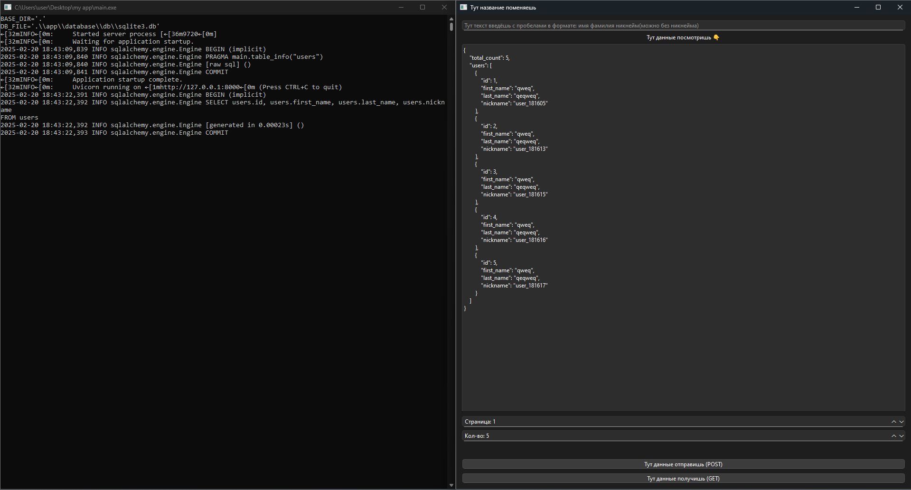

# The solution of the test task from the Mact by Vasily Sibirenkov



Этот проект представляет собой приложение, состоящее из двух частей: `Backend` и `Frontend`. `Backend` реализован с использованием `FastAPI`, а `Frontend` — с использованием `PyQt6`.
Данное приложение предназначено для управления пользователями и взаимодействия с базой данных через `API`.

---

## Важное примечание
- Фронтенд приложение будет работать исправно только при активном сервере.
- Убедитесь, что сервер `API` запущен и доступен по указанному базовому URL, прежде чем запускать фронтенд приложение.
- Если у вас возникли проблемы с запуском, проверьте, установлены ли все зависимости и правильно ли настроены пути в проекте.

## Структура проекта

```
root_dir/
│
├── backend/                # Директория с бэкенд приложением
│   ├── app/                # Основные файлы бэкенда
│   ├── README.md           # Документация для бэкенда
│   └── ...                 # Другие файлы и директории
│
├── frontend/               # Директория с фронтенд приложением
│   ├── app/                # Основные файлы фронтенда
│   ├── README.md           # Документация для фронтенда
│   └── ...                 # Другие файлы и директории
└── README.md               # Общая документация проекта
```

---

## Установка и запуск

1. **Перейдите в нужную директорию**:
   ```bash
   cd backend
   ```

2. **Создайте и активируйте виртуальное окружение**:
   ```bash
   python -m venv venv
   venv\Scripts\activate  # Для Windows
   # или
   source venv/bin/activate  # Для macOS и Linux
   ```

3. **Установите зависимости**:
   ```bash
   pip install -r requirements.txt
   ```

4. **Запустите приложение**:
   Инструкции по запуску указаны в `README.MD` внутри директорий: `frontend`, `backend`

5. **Скомпилируйте в `.exe` файл (по желанию)**:
   Инструкции по компиляции указаны в `README.MD` внутри директорий: `frontend`, `backend`

---

## Документация API

`Backend` приложение автоматически генерирует документацию для вашего `API`. Вы можете получить доступ к ней, перейдя по следующему адресу в браузере:

```
http://127.0.0.1:8000/docs
```

---

## Список зависимостей с комментариями о назначении каждой библиотеки:

- **altgraph==0.17.4** — Библиотека для работы с графами, используется в PyInstaller для анализа зависимостей.
- **annotated-types==0.7.0** — Библиотека для работы с аннотированными типами в Python, часто используется в Pydantic.
- **certifi==2025.1.31** — Набор корневых сертификатов для проверки SSL-соединений.
- **charset-normalizer==3.4.1** — Библиотека для автоматического определения кодировки текста.
- **colorama==0.4.6** — Библиотека для добавления цветного вывода в консоль.
- **discover==0.4.0** — Утилита для автоматического обнаружения тестов в проекте.
- **idna==3.10** — Библиотека для работы с международными доменными именами (IDNA).
- **iniconfig==2.0.0** — Библиотека для работы с INI-файлами, используется в pytest.
- **nuitka==2.6.6** — Компилятор Python в C/C++ для оптимизации и создания исполняемых файлов.
- **ordered-set==4.1.0** — Реализация упорядоченного множества (set) в Python.
- **packaging==24.2** — Библиотека для работы с версиями и метаданными пакетов.
- **pefile==2023.2.7** — Библиотека для анализа и работы с PE-файлами (исполняемые файлы Windows).
- **pluggy==1.5.0** — Плагинная система для Python, используется в pytest.
- **pydantic==2.10.6** — Библиотека для валидации данных и работы с моделями данных.
- **pydantic-core==2.27.2** — Ядро Pydantic для валидации и сериализации.
- **pyinstaller==6.12.0** — Утилита для создания исполняемых файлов из Python-скриптов.
- **pyinstaller-hooks-contrib==2025.1** — Дополнительные хуки для PyInstaller.
- **pyqt6==6.8.1** — Библиотека для создания графических интерфейсов (GUI) на основе Qt6.
- **pyqt6-qt6==6.8.2** — Основные компоненты Qt6 для PyQt6.
- **pyqt6-sip==13.10.0** — Инструмент для создания Python-биндингов к C++ библиотекам (используется в PyQt6).
- **pyside6==6.8.2.1** — Альтернативная библиотека для создания GUI на основе Qt6 (аналог PyQt6).
- **pyside6-addons==6.8.2.1** — Дополнительные модули для PySide6.
- **pyside6-essentials==6.8.2.1** — Основные модули PySide6.
- **pytest==8.3.4** — Фреймворк для тестирования Python-кода.
- **pytest-qt==4.4.0** — Плагин для тестирования приложений с графическим интерфейсом (Qt).
- **pywin32-ctypes==0.2.3** — Альтернативная реализация pywin32 для работы с Windows API.
- **requests==2.32.3** — Библиотека для выполнения HTTP-запросов.
- **setuptools==75.8.0** — Утилита для управления пакетами и зависимостями Python.
- **shiboken6==6.8.2.1** — Инструмент для создания Python-биндингов к C++ библиотекам (используется в PySide6).
- **typing-extensions==4.12.2** — Расширения для поддержки аннотаций типов в старых версиях Python.
- **urllib3==2.3.0** — Библиотека для работы с HTTP-запросами, используется в requests.
- **zstandard==0.23.0** — Библиотека для сжатия данных с использованием алгоритма Zstandard.
- **anyio==4.8.0** — Библиотека для асинхронного программирования, поддерживающая asyncio, trio и другие.
- **click==8.1.8** — Библиотека для создания командной строки (CLI) интерфейсов.
- **fastapi==0.115.8** — Современный фреймворк для создания API на Python.
- **greenlet==3.1.1** — Библиотека для легковесной конкурентности.
- **h11==0.14.0** — Реализация протокола HTTP/1.1, используется в Uvicorn.
- **sniffio==1.3.1** — Библиотека для определения используемого асинхронного фреймворка.
- **sqlalchemy==2.0.38** — ORM (Object-Relational Mapping) для работы с базами данных.
- **starlette==0.45.3** — Легковесный ASGI-фреймворк, используется в FastAPI.
- **uvicorn==0.34.0** — ASGI-сервер для запуска FastAPI и других ASGI-приложений.